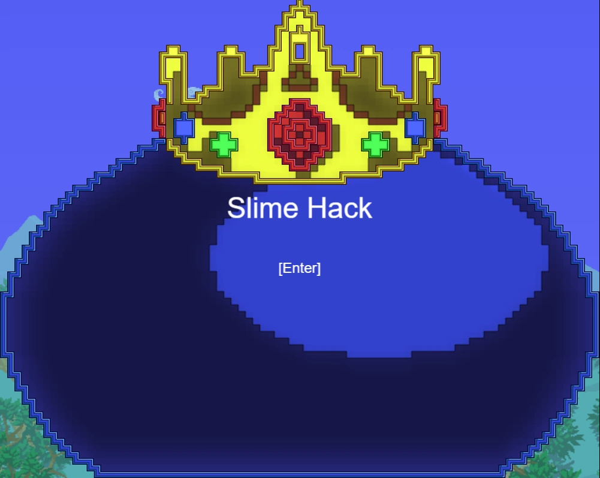

  
  # Slimehack

  ## Description

  Slimehack emerged as both an experiment and a challenge. My goal was to explore the potential of building a project using a highly transformative library, pushing the boundaries of my understanding of object-oriented programming. The entire development process proved to be enjoyable, and engaging with the open-source community at itch.io proved to be a rewarding experience, allowing me to learn a great deal.

  ## Table of Contents

  - [Installation](#installation)
  - [Usage](#usage)
  - [Credits](#credits)
  - [License](#license)
  - [Questions](#questions)

  ## Installation

  npm i in the root, the src folder, and the server folder -> npm run dev

  ## Usage

  Just follow the link: https://alarice.itch.io/slimehack
  

  ## Credits
  Shoutouts to Clembod and tienlev for the sprites!  
  https://clembod.itch.io/  
  https://tienlev.itch.io/  

  ## License

  This application is covered under the MIT license. Read more at [License: MIT](https://opensource.org/licenses/MIT)

  ## Questions

  1. Where can I find your github so that I can view your other projects? https://github.com/scicluna

  2. What email address should I use to contact you regarding further opportunities or questions? sciclunajl@gmail.com
